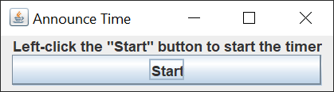
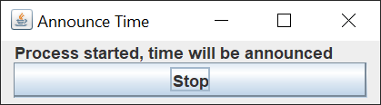
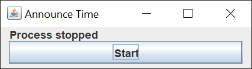

# Announce Time

## Introduction

I recently purchased the game Farm Manager 2021.  I became obsessed with the game and played for hours at a time.  I lost track of how much time was passing.

The game, like most video games for a computer, uses the full screen.  I can't see a clock from my computer, so I thought it would be a neat idea to have a clock that announces the time every hour.

So, I investigated Java text-to-speech and found [FreeTTS](https://freetts.sourceforge.io/).  The library is remarkable.  Unfortuately for me, the default voice is not.  I could barely understand a word the voice would say.  I searched for alternative voices, but couldn't find any.

I put up with the distorted voice for a couple of days, until I came up with the idea to record 23 WAV files of me saying the time.  "It's 12 midnight", "It's 1 am", etc.

I already had Audacity installed on my computer, so I quickly made 23 WAV files.  I used the microphone on my video camera, and my computer is right against the wall, so I sound like I'm inside a box.

The Java Swing GUI is small and simple.

When you left-click the "Start" button, the GUI changes to the following:

When you left-click the "Stop" button, the GUI changes to the following:

## Explanation

Oracle has a helpful tutorial, [Creating a GUI With Swing](https://docs.oracle.com/javase/tutorial/uiswing/index.html).  Skip the Learning Swing with the NetBeans IDE section.  

The Swing GUI is so simple, I'm not going to go into much detail.  I create a `JFrame` and a `JPanel`.  I use a Swing `Timer` to check the time every 30 seconds.  If it's the top of the hour, I read the appropriate WAV file and play the recording.

The code to play the recording is in the `SpeechListener` controller class.  Because the `actionPerformed` method is on a separate thread than the GUI's [Event Dispatch Thread](https://docs.oracle.com/javase/tutorial/uiswing/concurrency/dispatch.html), the GUI remains responsive.

The `ErrorDisplayDialog` comes from this [GitHub project](https://github.com/ggleblanc2/error-display-dialog)
